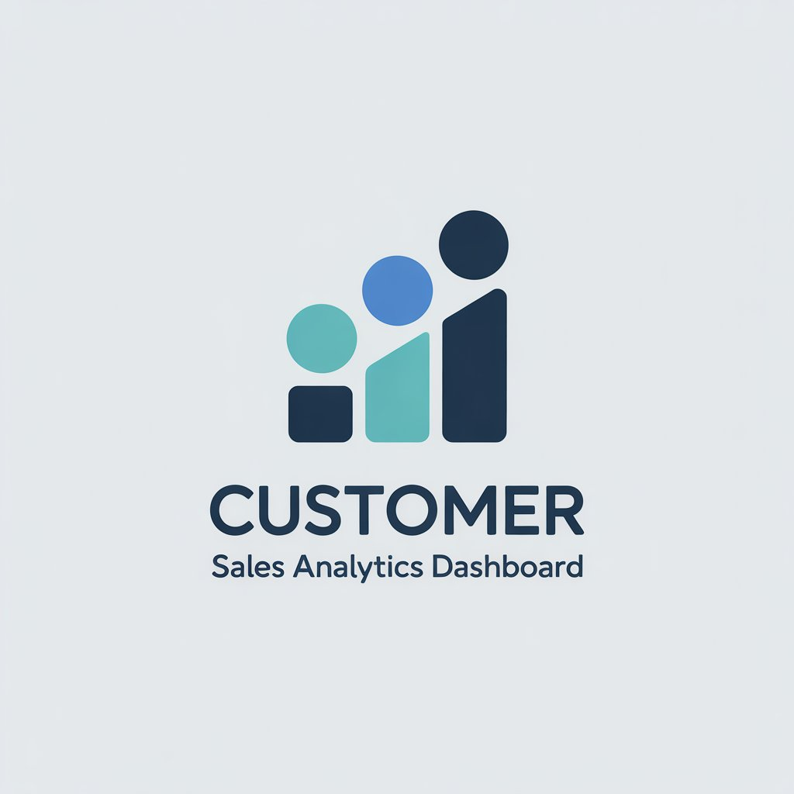

# 🏡 PropertyPulse - AI-Assisted Real-Estate Web Analytics Dashboard
**AI-Augmented Digital Analytics • Power BI • ChatGPT • Bolt.new**



---

## 🔎 One-line summary
AI-augmented analytics dashboard that analyzes real-estate website traffic, SEO keyword performance and conversions across cities / devices - built with Power BI (theme), Bolt.new for dashboard generation, and ChatGPT for automated insights.

---

## 🚀 Live demo
**Interactive dashboard (Bolt.new hosted):**  
https://propertypulse-dashbo-o0la.bolt.host/

---

## 📌 Quick Start (2 minutes)
1. Open the live demo link above.  
2. To reproduce locally in Power BI Desktop:
   - Download `data/sample_dataset.csv`.  
   - Open Power BI Desktop → **Home → Get Data → Text/CSV** → load the CSV.  
   - Import the theme: **Home → Switch theme → Import theme** → choose `assets/branding/PropertyPulseTheme.json`.  
   - Recreate pages using the layout described in `/README.md` sections (KPI strip → Executive Insights → Trend + Top Pages → Page table + City matrix).  
3. See `documents/PropertyPulse_Case_Study.pdf` for step-by-step screenshots and decisions.

---

## 📂 Repo structure

propertypulse-real-estate-analytics-dashboard/
 ├── README.md
 ├── LICENSE
 ├── dashboard/
 │ ├── PropertyPulse_Dashboard_Screenshot.png
 │ └── dashboard-live-link.txt
 ├── documents/
 │ ├── PropertyPulse_Case_Study.pdf
 │ └── Business_Recommendations.pdf
 ├── data/
 │ └── sample_dataset.csv
 ├── assets/
 │ ├── branding/
 │ │ ├── logo.png
 │ │ ├── PropertyPulseTheme.json
 │ │ └── color-palette.png
 │ └── icons/
 │ ├── customer.png
 │ ├── revenue.png
 │ └── trend.png
 └── metadata.md

---

## 💡 Why this project matters (business value)
- **Identify priority fixes**: surface top pages causing high bounce (e.g., Blog_Rental_Tips - 71% bounce) so product/UX teams can act.  
- **Focus marketing spend**: shows Mumbai, Delhi, Bangalore as high-intent markets for targeted acquisition.  
- **Quantified opportunity**: closing the desktop↔mobile conversion gap (desktop 5.6% vs mobile 4.0%) could yield a ~18–25% uplift in leads from mobile.

---

## 🧰 Tools & Tech
- Bolt.new - AI dashboard generation & hosting  
- ChatGPT / Gemini - Data cleaning prompts & executive summaries  
- Power BI Desktop (+ theme JSON) - visual build & export  
- Google Sheets - lightweight data prep  
- Python (pandas) - optional preprocessing  
- GitHub - repository & documentation

---

## 📈 Key outputs (what you’ll see)
- KPI strip (Sessions, Users, Conversion Rate, Bounce Rate)  
- AI-generated Executive Insights box (4 bullets)  
- Time series: Sessions & Conversions over time (weekly)  
- Top Performing Pages (bar chart) with conversion rates  
- Page-level performance table with conditional formatting  
- City performance heatmap / matrix

---

## 🛠 Reproducible examples (copy-paste)

**Pandas - clean bounce_rate & export weekly aggregates**
```python
import pandas as pd
df = pd.read_csv('data/sample_dataset.csv', parse_dates=['date'])
df['bounce_rate'] = df['bounce_rate'].astype(str).str.rstrip('%').astype(float)
df['conversion_rate'] = df['conversions'] / df['sessions']
df['week'] = df['date'].dt.to_period('W').apply(lambda x: x.start_time)
weekly = df.groupby('week').agg(
    total_sessions=('sessions','sum'),
    total_conversions=('conversions','sum'),
    avg_bounce=('bounce_rate','mean'),
    avg_conv=('conversion_rate','mean')
).reset_index()
weekly.to_csv('data/weekly_agg.csv', index=False)
